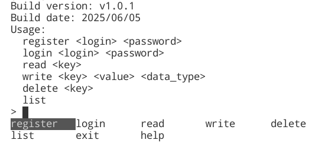
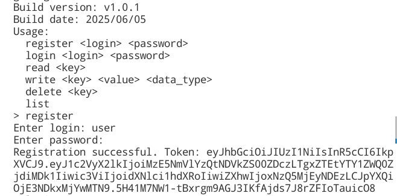
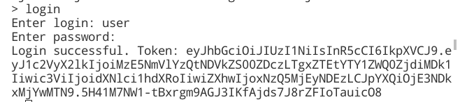
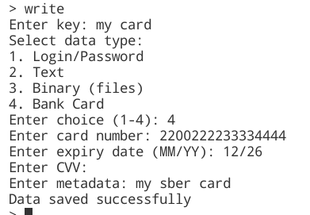
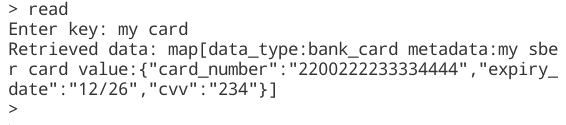
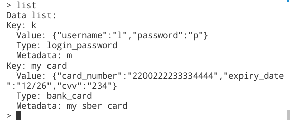
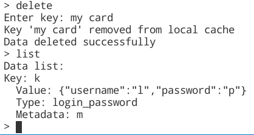
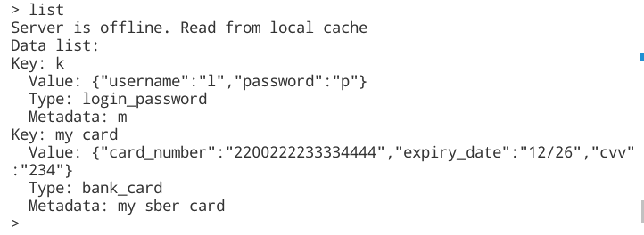
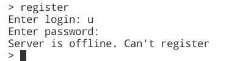

# GophKeeper
Выпускной проект по курсу "Продвинутый Go-разработчик" от Яндекс Практикум. 

GophKeeper представляет собой клиент-серверную систему, позволяющую пользователю надёжно и безопасно хранить логины, пароли, бинарные данные и прочую приватную информацию.


## Содержание

- [Особенности](#особенности)
- [Сервер](#сервер)
- [Клиент](#клиент)
- [Взаимодействие сервера и клиента](#взаимодействие-сервера-и-клиента)
- [Инструкции по запуску](#инструкции-по-запуску)
- [Использование](#использование)
- [API-эндпоинты](#api-эндпоинты)


## Особенности

- **Безопасность**:
  - AES-шифрование приватных данных.
  - Хеширование паролей (bcrypt).
  - Поддержка ротации мастер-ключа.
  - Взаимодействие клиентов с сервером по TLS.
  - Управление сессиями через JWT-токены.

- **Управление приватными данными**:
  - Возможность сохранения, чтения и удаления приватных данных.
  - Поддержка метаданных для дополнительного контекста.

- **Возможность работы при потере соединения**:
  - Переход клиента в read-only режим при потере соединения с сервером.


## Сервер

Сервер GophKeeper предоставляет REST API для управления пользователями и их приватными данными. Он отвечает за:

- **Регистрацию, аутентификацию и авторизацию пользователей**:
  - Регистрация новых пользователей с хэшированием паролей.
  - Генерация JWT-токенов для аутентификации.

- **Управление приватными данными**:
  - Сохранение, получение, вывод и удаление данных.
  - Шифрование данных перед сохранением и дешифрование при запросе.

- **Ротацию мастер-ключа**:
  - Поддержка автоматической ротации мастер-ключа каждые 3 суток.


## Клиент

Клиент GophKeeper представляет собой CLI интерфейс (при вводе help или нажатии на Tab появляется перечень доступных команд) для взаимодействия с сервером. Клиент позволяет пользователям:

- **Регистрироваться и аутентифицироваться в системе**:
  - Дополнительно реализован безопасный ввод пароля.
- **Управлять своими приватными данными**:
  - Пользователь может сохранять, получать, выводить и удалять данные.
- **Работать при потере соединения с сервером**:
  - Клиент переходит в read-only режим и может выдавать сохраненные в кеше данные.
- **Работать с различными типами данных**:
  - Поддерживаются пары логин/пароль, произвольные текстовые данные, произвольные бинарные данные, данные банковских карт.
- **Возможность работы на ОС Windows, Linux, MacOS**

## Взаимодействие сервера и клиента

1. **Регистрация пользователя**:
   - Клиент отправляет запрос на регистрацию с логином и паролем.
   - Сервер хэширует пароль, сохраняет пользователя в базе данных и возвращает статус успешной регистрации.

2. **Аутентификация**:
   - Клиент отправляет логин и пароль для входа.
   - Сервер проверяет учетные данные и возвращает JWT-токен.

3. **Управление данными**:
   - Клиент использует JWT-токен для выполнения операций с приватными данными.
   - Сервер шифрует данные перед сохранением и дешифрует их при запросе.

4. **Ротация мастер-ключа**:
   - Автоматически каждые 3 суток происходит ротация мастер-ключа.
   - Во время ротации клиент будет получать информацию о недоступности сервера.
   - Сервер дешифрует все данные старым ключом, генерирует новый мастер-ключ, шифрует данные заново и обновляет `.env` файл.


## Инструкции по запуску


### 1. Локальный запуск
Клонируйте репозиторий
```bash
git clone https://github.com/dyupina/GophKeeper
cd GophKeeper
```
Установите зависимости
```bash
go mod download
```
Переименуйте файл `.env.example` в `.env` и при необходимости отредактируйте переменные.  
Создайте БД:
```bash
sudo -u postgres -i
psql -U postgres
create database gophkeeper_db;
create user gophkeeper_user with encrypted password 'gophkeeper_user';
grant all privileges on database gophkeeper_db to gophkeeper_user;
```
Выполните ``` make all ``` для сборки клиента под 3 платформы, сборки сервера и запуска сервера.  
Выполните ``` make run_server ``` для сборки и запуска сервера.  
Выполните ``` make run_client ``` для сборки и запуска клиента на Linux.  


### 2. Запуск в docker-контейнерах
Клонируйте репозиторий
```bash
git clone https://github.com/dyupina/GophKeeper
cd GophKeeper
```  
Переименуйте файл `.env.example` в `.env` и отредактируйте переменные.  
Выполните ``` make all_docker ``` для создания контейнеров с сервером, клиентом и БД.


## Использование

### 1. Список доступных команд


### 2. Регистрация пользователя



### 3. Аутентификация



### 4. Сохранение данных


### 5. Чтение данных


### 6. Вывод всех сохраненных данных пользователя


### 6. Удаление данных


### 8. Работа в режиме read-only
  



## API-эндпоинты

| Метод | URL                 | Описание                            |
|-------|---------------------|-------------------------------------|
| POST  | `/register`         | Регистрация нового пользователя     |
| POST  | `/login`            | Аутентификация пользователя         |
| POST  | `/save`             | Сохранение приватных данных         |
| POST  | `/get`              | Получение приватных данных          |
| POST  | `/delete`           | Удаление приватных данных           |
| GET   | `/list`             | Получение списка всех данных        |
| GET   | `/ping`             | Проверка доступности сервера        |

